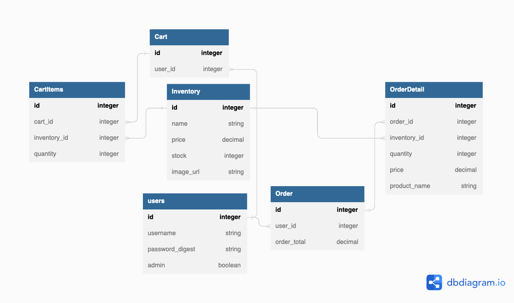

# Flatiron School - FLEX SE - Phase 4 - Project - BeefMarket

This project is to fulfill the requirements for Phase 4 of the Flatiron School - Flex SE program.
This project is created with a React Frontend and Rails Backend, and is setup to be deployed to Heroku for hosting.
You can view the complete application hosted on Heroku with this link: [Link to Heroku App]

[Link to Heroku App]:http://beef-market.herokuapp.com/

## Description

BeefMarket is a one stop shop website where you can signup for free to purchase premium cut beef at a fair cost.
In this website you will be able to:
- Sign up for an account
- Login to view BeefMarket's inventory
- Add items from the inventory to your cart
- Submit your cart for an order

## DB Design

The following is a diagram of the DB Structure used for the BeefMarket App.


## Requirements

- Ruby 2.7.4
- NodeJS (v16), and npm
- Heroku CLI
- Postgresql

## Setup

When you're ready to start building your project, run:

```sh
bundle install
rails db:create db:migrate db:seed
npm install --prefix client
```

You can use the following commands to run the application:

- `rails s`: run the backend on [http://localhost:3000](http://localhost:3000)
- `npm start --prefix client`: run the frontend on [http://localhost:4000](http://localhost:4000)

## Deploying

To deploy to Heroku, first log in to your Heroku account using the Heroku CLI:

```sh
heroku login
```

Create the new Heroku app:

```sh
heroku create my-app-name
```

Add the buildpacks for Heroku to build the React app on Node and run the Rails
app on Ruby:

```sh
heroku buildpacks:add heroku/nodejs --index 1
heroku buildpacks:add heroku/ruby --index 2
```

To deploy, commit your code and push the changes to Heroku:

```sh
git add .
git commit -m 'Commit message'
git push heroku main
```

> Note: depending on your Git configuration, your default branch might be named
> `master` or `main`. You can verify which by running
> `git branch --show-current`. If it's `master`, you'll need to run
> `git push heroku master` instead.

Any time you have changes to deploy, just make sure your changes are committed
on the main branch of your repo, and push those changes to Heroku to deploy
them.

You can view your deployed app with:

```sh
heroku open
```

## Environment Setup

### Install the Latest Ruby Version

Verify which version of Ruby you're running by entering this in the terminal:

```sh
ruby -v
```

Make sure that the Ruby version you're running is listed in the [supported
runtimes][] by Heroku. At the time of writing, supported versions are 2.6.8,
2.7.4, or 3.0.2. Our recommendation is 2.7.4, but make sure to check the site
for the latest supported versions.

If it's not, you can use `rvm` to install a newer version of Ruby:

```sh
rvm install 2.7.4 --default
```

You should also install the latest versions of `bundler` and `rails`:

```sh
gem install bundler
gem install rails
```

[supported runtimes]: https://devcenter.heroku.com/articles/ruby-support#supported-runtimes

### Install NodeJS

Verify you are running a recent version of Node with:

```sh
node -v
```

If your Node version is not 16.x.x, install it and set it as the current and
default version with:

```sh
nvm install 16
nvm use 16
nvm alias default 16
```

You can also update your npm version with:

```sh
npm i -g npm
```

### Sign Up for a [Heroku Account][heroku signup]

You can sign up at for a free account at
[https://signup.heroku.com/devcenter][heroku signup].

### Download the [Heroku CLI][heroku cli] Application

Download the Heroku CLI. For OSX users, you can use Homebrew:

```sh
brew tap heroku/brew && brew install heroku
```

For WSL users, run this command in the Ubuntu terminal:

```sh
curl https://cli-assets.heroku.com/install.sh | sh
```

If you run into issues installing, check out the [Heroku CLI][heroku cli]
downloads page for more options.

After downloading, you can login via the CLI in the terminal:

```sh
heroku login
```

This will open a browser window to log you into your Heroku account. After
logging in, close the browser window and return to the terminal. You can run
`heroku whoami` in the terminal to verify that you have logged in successfully.

[heroku signup]: https://signup.heroku.com/devcenter
[heroku cli]: https://devcenter.heroku.com/articles/heroku-cli#download-and-install

### Install Postgresql

Heroku requires that you use PostgreSQL for your database instead of SQLite.
PostgreSQL (or just Postgres for short) is an advanced database management
system with more features than SQLite. If you don't already have it installed,
you'll need to set it up.

#### PostgreSQL Installation for WSL

To install Postgres for WSL, run the following commands from your Ubuntu terminal:

```sh
sudo apt update
sudo apt install postgresql postgresql-contrib libpq-dev
```

Then confirm that Postgres was installed successfully:

```sh
psql --version
```

Run this command to start the Postgres service:

```sh
sudo service postgresql start
```

Finally, you'll also need to create a database user so that you are able to
connect to the database from Rails. First, check what your operating system
username is:

```sh
whoami
```

If your username is "ian", for example, you'd need to create a Postgres user
with that same name. To do so, run this command to open the Postgres CLI:

```sh
sudo -u postgres -i
```

From the Postgres CLI, run this command (replacing "ian" with your username):

```sh
createuser -sr ian
```

Then enter `control + d` or type `logout` to exit.

[This guide][postgresql wsl] has more info on setting up Postgres on WSL if you
get stuck.

[postgresql wsl]: https://docs.microsoft.com/en-us/windows/wsl/tutorials/wsl-database#install-postgresql

#### Postgresql Installation for OSX

To install Postgres for OSX, you can use Homebrew:

```sh
brew install postgresql
```

Once Postgres has been installed, run this command to start the Postgres
service:

```sh
brew services start postgresql
```


